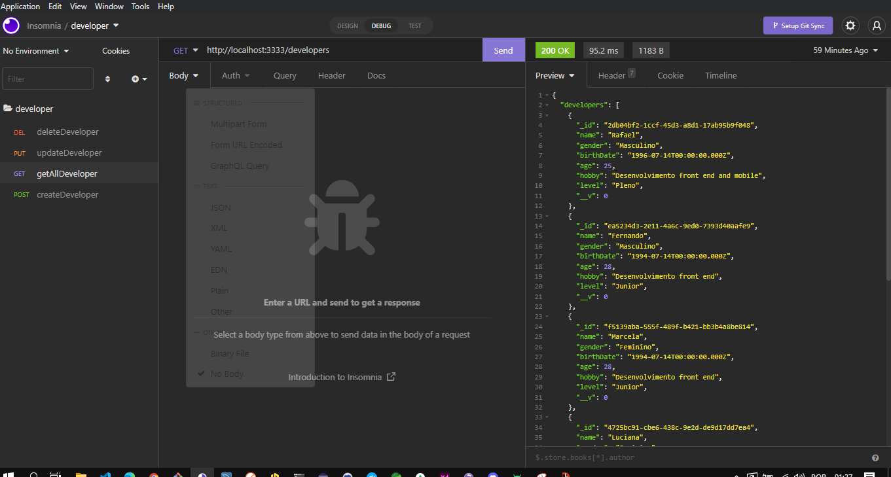

<h3 align="center">
    <br></br>
      API Developer contem um Crud com os métodos (​GET​, ​POST​, ​PUT/PATCH​ e ​DELETE​).

</h3>


# Índice

- [Sobre](#sobre)
- [Tecnologias Utilizadas](#tecnologias-utilizadas)
- [Como Usar](#como-usar)
- [Proposta](#proposta)
- [Como Contribuir](#como-contribuir)

## :bookmark: Sobre
O <strong>Developer</strong> é um projeto teste da Gazin, utilizado para validar os conhecimentos dos candidatos.


<a id="tecnologias-utilizadas"></a>

## :rocket: Tecnologias Utilizadas

O projeto foi desenvolvido utilizando as seguintes tecnologias

- [Nodejs]("")
- [TypeScript]("")
- [MongoDB]("")


## Proposta

O projeto consiste em criar um sistema de cadastro de Desenvolvedores, que deverá obrigatóriamente, estar
associado a um determinado nível.

[ ] - O candidato deverá criar então 2 CRUDs completos, sendo:

```
- CRUD de níveis
- CRUD dos desenvolvedores
```

## :heavy_check_mark: :iphone: Versão Desktop

<h1 align="center">
    
</h1>


<a id="como-usar"></a>

## :fire: Como usar
Lembre-se de criar o seu Banco de dados  no Cloud do Mongodb para conectar a APi e Database . Em seguida, defina no arquivo .env as configurações do seu Database (remova o example do arquivo .env.example).


1. Faça um clone :

```sh
  $ git clone ''

```

2. Executando a Aplicação:

```sh
  # Instale as dependências
  $ npm install 
  ou 
  $ Yarn

  # Inicie a aplicação web
  $ cd teste-gazin

  $ yarn dev
  ou
  $ npm dev
```

<a id="como-contribuir"></a>


# :recycle: Como contribuir

- Faça um Fork desse repositório,
- Crie uma branch com a sua feature: `git checkout -b my-feature`
- Commit suas mudanças: `git commit -m 'feat: My new feature'`
- Push a sua branch: `git push origin my-feature`


## :memo: License

Esse projeto está sob a licença MIT. Veja o arquivo [LICENSE](LICENSE.md) para mais detalhes.


<h4 align="center">
    Feito com 💜 by <a href="https://portfolio-rafael-rufino.vercel.app/" target="_blank">Rafael Rufino</a>
</h4>
