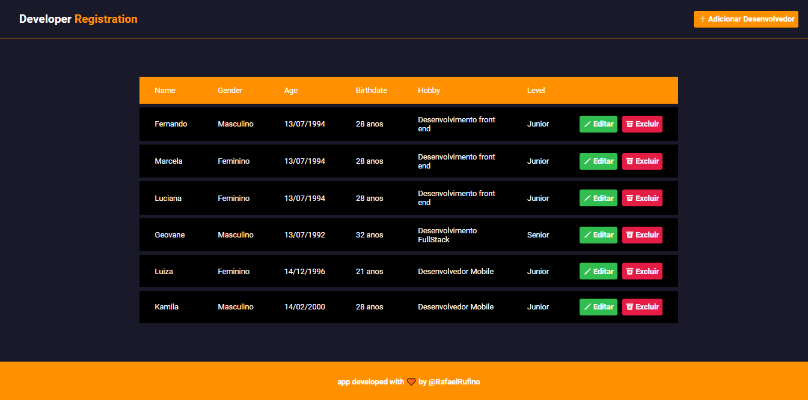
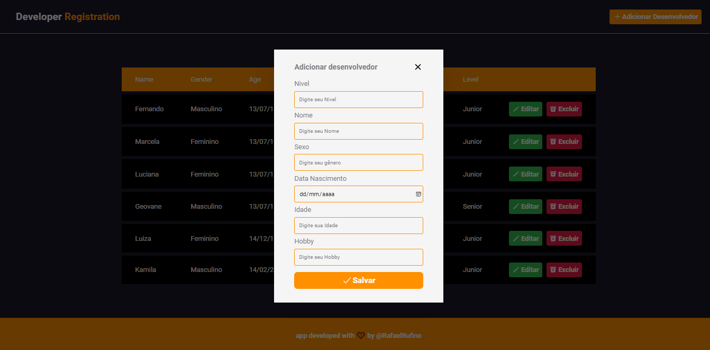
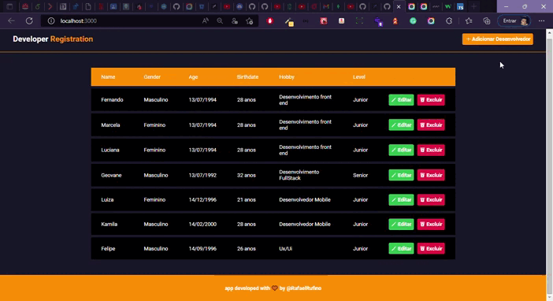

<h3 align="center">
    
    <br><br>
    <b> Sistema Web para cadastro de desenvolvedores.</b>  
    <br>
</h3>

# Índice

- [Sobre](#sobre)
- [Tecnologias Utilizadas](#tecnologias-utilizadas)
- [Conceitos Aprendido](#conceito-aprendido)
- [Como Usar](#como-usar)
- [Como Contribuir](#como-contribuir)

# Features

 - [ ] Funcionalidade do Crud com os métodos (​GET​, ​POST​, ​PUT​ e ​DELETE​). 
 - [ ] Implementação do modal.
 - [ ] Consumo de Api.
 - [ ] Construção de layout


<a id="tecnologias-utilizadas"></a>

## :rocket: Tecnologias Utilizadas

O projeto foi desenvolvido utilizando as seguintes tecnologias


- [ ] React 
- [ ] Typescript
- [ ] Context Api
- [ ] Modal
- [ ] Swr - Stale-hile-revalidate - Data Fetching
- [ ] Hooks - React Hooks
- [ ] React Icons
- [ ] Styled - Components
- [ ] Axios
- [ ] Google Fonts Roboto
- [ ] Configuração de theme
- [ ] data-fns


## :heavy_check_mark: :iphone: Versão Desktop

<h1 align="center">
    
</h1>

<h1 align="center">
    
</h1>

## :heavy_check_mark: :iphone: Video da aplicação

<h1 align="center">
    
</h1>

<p> Utilize o yarn ou o npm install para instalar as dependências do projeto. Em seguida, inicie o projeto.</p>

```
yarn start ou npm start

```

<a id="como-contribuir"></a>


# :recycle: Como contribuir

- Faça um Fork desse repositório,
- Crie uma branch com a sua feature: `git checkout -b my-feature`
- Commit suas mudanças: `git commit -m 'feat: My new feature'`
- Push a sua branch: `git push origin my-feature`


<a id="como-usar"></a>
## :fire: Como usar

1. Faça um clone :

```sh
  $ git clone https://github.com/Rafael-Rufino/teste-gazin/tree/master/front-end
```

## :memo: License

Esse projeto está sob a licença MIT. Veja o arquivo [LICENSE](LICENSE.md) para mais detalhes.


<h4 align="center">
    Feito com 💜 by <a href="https://portfolio-rafael-rufino.vercel.app/" target="_blank">Rafael Rufino</a>
</h4>
